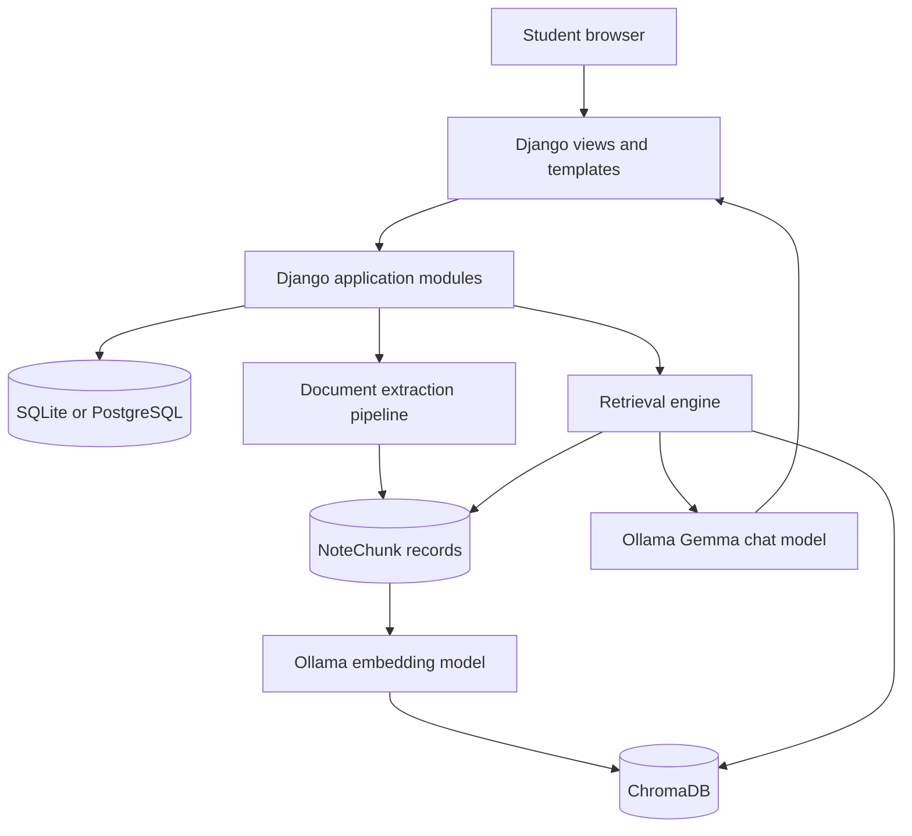
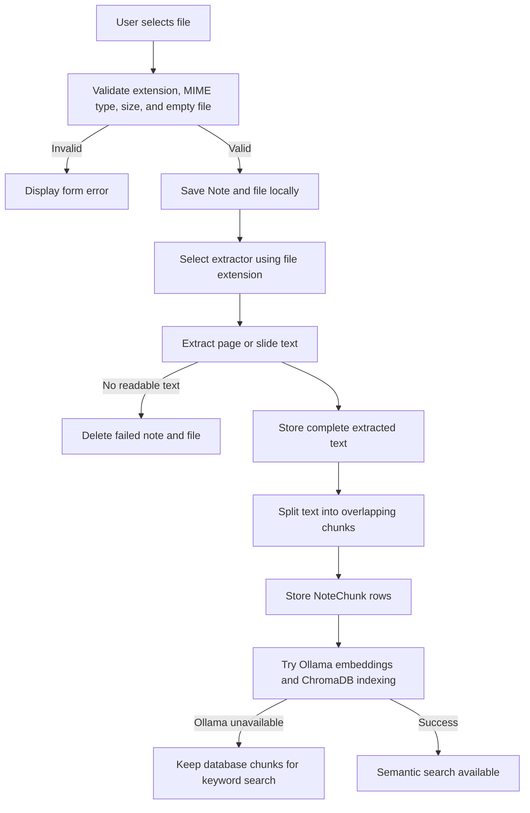
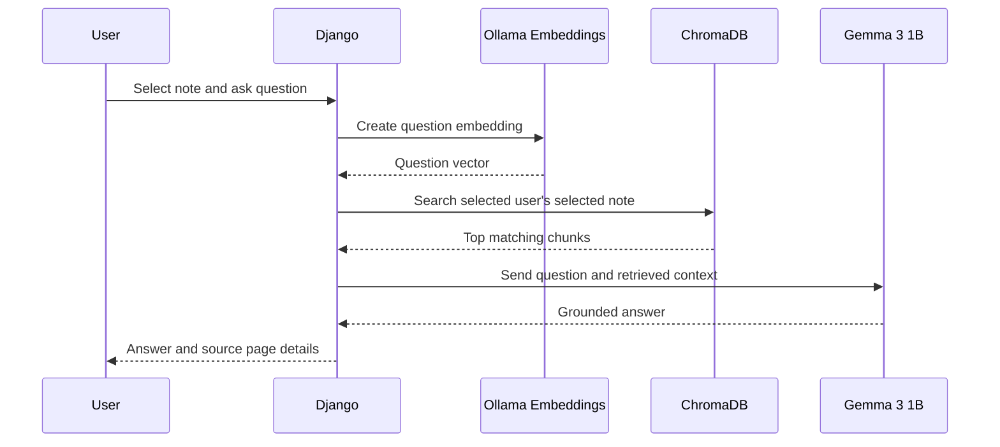
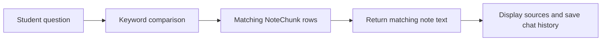
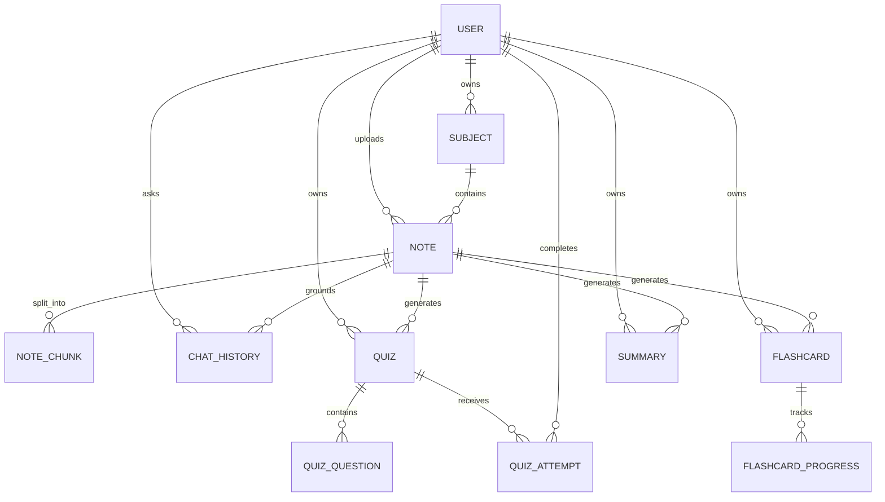

# AI Study Buddy: Project Working and Technical Reference

## 1. Purpose

AI Study Buddy is a local-first Django web application that converts student notes into an interactive study workspace. A student can:

- Upload PDF, DOCX, PPTX, PNG, JPG, TIFF, or BMP files.
- Organize notes into subjects.
- Ask questions grounded in a selected note.
- Generate and attempt quizzes.
- Generate and revise flashcards.
- Generate bullet, paragraph, or exam-focused summaries.
- Export quizzes as PDF and flashcards as CSV.
- Review progress and weak topics on the dashboard.

This document describes the implemented system. It can be used for maintenance, demonstrations, viva preparation, and future report generation.

## 2. Project Objectives

The main objectives are:

1. Keep student notes and AI processing on the user's computer.
2. Avoid paid cloud AI APIs and API keys.
3. Ground answers and generated study material in uploaded notes.
4. Keep core workflows usable when the local AI runtime is unavailable.
5. Provide a simple Django project that demonstrates document processing, retrieval-augmented generation, local LLM integration, and learning analytics.

## 3. Technology Stack

| Area | Technology | Purpose |
|---|---|---|
| Web framework | Django 4.2 | Authentication, forms, views, templates, routing, and ORM |
| Main database | SQLite by default | Stores users, notes, chunks, chats, quizzes, attempts, flashcards, progress, and summaries |
| Optional database | PostgreSQL | Alternative relational database for larger deployments |
| PDF extraction | PyMuPDF | Extracts page text from PDF files |
| DOCX extraction | python-docx | Extracts paragraph text from Word files |
| PPTX extraction | python-pptx | Extracts text from PowerPoint slides |
| Image OCR | Pillow, pytesseract, Tesseract OCR | Reads text from supported image notes |
| Vector database | ChromaDB | Stores note embeddings and supports semantic retrieval |
| Local AI runtime | Ollama | Runs language and embedding models locally |
| Chat model | `gemma3:1b` | Generates answers, quizzes, flashcards, and summaries |
| Embedding model | `nomic-embed-text` | Converts note chunks and questions into vectors |
| PDF export | xhtml2pdf | Produces downloadable quiz PDFs |
| Production serving | Waitress and WhiteNoise | Serves Django and static files on Windows |

## 4. Privacy and API Usage

The application does not call OpenAI, Gemini, Anthropic, or another cloud AI provider.

Django communicates with Ollama through a local HTTP API:

```text
http://localhost:11434
```

This is an API call, but it is a loopback call between programs on the same computer. Uploaded note content is not intentionally sent across the internet.

Internet access is needed only for initial software and model downloads. After installation, the application, database, vector store, OCR, and AI models can operate locally.

## 5. Why Ollama Is Used

Ollama is the local model runtime. Django itself cannot directly execute a large language model. Ollama handles:

- Downloading and storing supported models.
- Loading models into memory.
- Running inference on CPU or supported GPU hardware.
- Exposing a simple local HTTP interface.
- Returning generated text and embeddings to Django.

Ollama was selected because it is simple to install, does not require an API key, supports Windows, and keeps model processing local.

### Selected Models

#### `gemma3:1b`

Used for:

- Chat answers.
- Quiz generation.
- Flashcard generation.
- Summary generation.

It is approximately 815 MB and is selected because it is lightweight enough for lower-spec personal systems while still supporting instruction-based study tasks. A larger model can improve answer quality but requires more memory and processing time.

#### `nomic-embed-text`

Used for:

- Converting note chunks into numerical vectors.
- Converting a student's question into a vector.
- Finding semantically similar note chunks in ChromaDB.

It is approximately 274 MB and is specialized for text embeddings rather than conversational text generation.

## 6. High-Level Architecture



The system is a Django monolith. Each feature is separated into a Django app, while reusable document and AI logic lives in `rag_engine/`.

## 7. Main Application Modules

### `accounts/`

Provides registration, login, logout, and Django user authentication.

### `dashboard/`

Calculates and displays:

- Total notes, quizzes, flashcards, and summaries.
- Recent study activity.
- Quiz attempt count and average score.
- Performance by note/topic.
- Weak topics below 60 percent.

### `notes/`

Handles subject folders, note upload, validation, extraction, chunk storage, note lists, and note details.

### `rag/`

Provides the Chat Tutor page and persists questions, answers, retrieval mode, model usage, and source metadata.

### `quiz/`

Generates MCQ, true/false, and short-answer quizzes. It stores questions, accepts attempts, calculates scores, displays results, and exports quiz PDFs.

### `flashcards/`

Generates flashcards, supports revision sessions, records known/review-again actions, calculates mastery, and exports CSV files.

### `summaries/`

Generates and stores bullet, paragraph, and exam-focused summaries.

### `rag_engine/`

Contains the shared document processing and local AI pipeline:

- File-type routing.
- PDF, DOCX, PPTX, and image readers.
- Text chunking.
- Ollama client.
- ChromaDB indexing and retrieval.
- Keyword retrieval fallback.
- Grounded answer generation.

## 8. Note Upload Workflow



### Upload Rules

- Maximum size: 20 MB.
- Empty files are rejected.
- Supported extensions: PDF, DOCX, PPTX, PNG, JPG, JPEG, TIF, TIFF, and BMP.
- Corrupt, unreadable, encrypted, or textless documents produce a form error instead of a server crash.
- Only successfully processed notes appear in chat and generator selectors.

### Text Chunking

Each extracted page is divided using:

- Chunk size: 1000 characters.
- Overlap: 150 characters.

Overlap reduces the chance that an important sentence is split across two chunks. Each chunk stores its note, user, page number, and chunk index.

## 9. Retrieval-Augmented Generation Workflow

RAG means Retrieval-Augmented Generation. Instead of asking the model to answer from general knowledge alone, the application retrieves relevant note sections and includes them in the prompt.

### RAG Does Not Generate Content by Itself

RAG is an architecture or workflow, not a model. It combines two separate operations:

1. **Retrieval:** Find relevant information from the uploaded notes.
2. **Generation:** Give that information to a language model so it can write a useful answer.

The responsibilities in this project are:

| Component | Responsibility |
|---|---|
| Django | Controls the workflow, validates ownership, builds prompts, stores results, and renders pages |
| PyMuPDF/DOCX/PPTX/OCR readers | Convert uploaded files into text |
| `NoteChunk` and ChromaDB | Store searchable note sections |
| `nomic-embed-text` through Ollama | Converts text into vectors for semantic retrieval |
| Retrieval code | Selects the note chunks most relevant to the question |
| `gemma3:1b` through Ollama | Reads the retrieved context and writes the final natural-language answer |

Therefore:

```text
RAG = retrieval + context preparation + model generation
```

Ollama is not a replacement for RAG. Ollama is the local runtime that executes the two models used inside the RAG workflow.

### Simple Example

Assume an uploaded biology note contains:

```text
Photosynthesis converts sunlight into chemical energy.
```

The student asks:

```text
What does photosynthesis convert?
```

The process is:

1. Retrieval locates the chunk containing the photosynthesis sentence.
2. Django creates a prompt containing that chunk and the question.
3. `gemma3:1b` receives the prompt through Ollama.
4. The model generates a readable answer such as:

```text
Photosynthesis converts sunlight into chemical energy.
```

Without retrieval, the model would answer from its pretrained knowledge and might ignore the uploaded note. Without the language model, retrieval can only return the original matching text rather than compose a clear answer.



### How RAG Works Before Ollama Is Installed

The application currently runs a reduced fallback form of RAG:



Detailed steps:

1. The student selects one processed note and asks a question.
2. Django reads the note's `NoteChunk` rows from the relational database.
3. The question is split into words.
4. Common stopwords such as `what`, `the`, and `from` are removed.
5. Each chunk is scored by the number of matching terms.
6. Up to five best chunks are selected.
7. Because `gemma3:1b` is unavailable, the application returns up to 1200 characters of retrieved context.
8. The question, returned context, source pages, and retrieval mode are saved in `ChatHistory`.

This mode is grounded in the notes and functional, but it has limitations:

- It matches words rather than meaning.
- It may miss synonyms.
- It returns extracted text instead of a newly written answer.
- It cannot explain or combine multiple chunks as naturally as a language model.

### How Full RAG Works After Ollama Is Installed

After Ollama, `gemma3:1b`, and `nomic-embed-text` are available, the complete RAG pipeline runs.

#### Phase 1: Indexing During Upload

1. The uploaded document is converted to text.
2. Text is divided into overlapping chunks.
3. Django sends every chunk to Ollama's local embedding endpoint.
4. Ollama runs `nomic-embed-text`.
5. The model returns a numerical vector representing the chunk's meaning.
6. Django stores the vector, chunk text, note ID, user ID, page number, and chunk index in ChromaDB.

An embedding does not contain a written answer. It is a numerical representation used to compare semantic similarity.

#### Phase 2: Retrieval During Chat

1. Django sends the student's question to `nomic-embed-text`.
2. Ollama returns a question vector.
3. ChromaDB compares the question vector with stored chunk vectors.
4. ChromaDB returns up to five semantically similar chunks.
5. Results are restricted to the logged-in user and selected note.

Semantic retrieval can connect related meaning even when exact wording differs. For example, a question containing `plants make energy from light` can retrieve a chunk containing `photosynthesis converts sunlight into chemical energy`.

#### Phase 3: Answer Generation

1. Django combines the retrieved chunks into a context block.
2. Django adds instructions to answer only from that context.
3. Django sends the complete prompt to Ollama's generation endpoint.
4. Ollama runs `gemma3:1b`.
5. The model writes the final student-friendly answer.
6. Django displays the answer with source note and page metadata.
7. The complete interaction is stored in `ChatHistory` with `retrieval_mode="vector"` and `used_llm=True`.

### Exact Role of Each Ollama Model

```text
nomic-embed-text:
Question or note text -> numerical vector
Purpose -> find relevant information

gemma3:1b:
Instructions + retrieved note text + question -> written response
Purpose -> explain, summarize, and format information
```

For quizzes, flashcards, and summaries, RAG retrieval is not currently used. Django sends the beginning of the selected note directly to `gemma3:1b`. Ollama runs the model, while Django validates, parses, and stores the output. A future improvement is to use chunk retrieval for these generators so long notes are handled more intelligently.

### Semantic Retrieval

When Ollama and `nomic-embed-text` are available:

1. Each note chunk is embedded during upload.
2. The question is embedded during chat.
3. ChromaDB returns up to five similar chunks.
4. Queries are filtered by both `user_id` and `note_id`.

### Keyword Fallback

When embeddings or ChromaDB are unavailable:

1. The question is tokenized.
2. common stopwords are removed.
3. Terms are compared with each database chunk.
4. Chunks with the most matching terms are returned.

This fallback is less intelligent than semantic retrieval but keeps chat functional.

### Answer Generation

The retrieved chunks are joined as context. The prompt instructs Gemma to:

- Use only the supplied notes.
- Keep the answer clear and student-friendly.
- Return a fixed not-found message when the answer is absent.

If Gemma is unavailable, the application returns the best retrieved note context instead of failing.

## 10. Quiz Workflow

The student selects:

- A processed note.
- Question type.
- Difficulty.
- Number of questions.

Gemma receives up to 5000 characters of note text and is instructed to return JSON containing each question, options, answer, and explanation. The application parses the JSON and stores a `Quiz` with related `QuizQuestion` rows.

If Ollama is unavailable or returns invalid JSON, a deterministic generator creates the requested number of questions from extracted note sentences.

During an attempt:

1. Submitted answers are compared with stored correct answers.
2. The score and total questions are stored in `QuizAttempt`.
3. Percentage is calculated from the stored score.
4. Results contribute to dashboard analytics.

## 11. Flashcard Workflow

Gemma receives up to 5000 characters of note text and returns JSON front/back pairs. Existing cards for that user and note are replaced with the new set.

If Ollama is unavailable, sentences from the note become deterministic cards. The fallback cycles through available sentences until it produces the requested number.

Revision actions update `FlashcardProgress`:

- `review_count` tracks total reviews.
- `known_count` tracks successful recall.
- Mastery percentage is `known_count / review_count * 100`.

## 12. Summary Workflow

The student chooses bullet, paragraph, or exam-focused output. Gemma receives up to 6000 characters from the selected note and generates the summary.

Without Ollama:

- Bullet mode converts selected sentences into bullets.
- Paragraph mode joins selected sentences.
- Exam mode labels sentences as exam points.

Every result is stored in the `Summary` table.

## 13. Database Model Relationships



All primary study records are linked to a Django user. Views filter records by the logged-in user to prevent one user from accessing another user's notes and generated material.

## 14. Local Storage Locations

| Data | Default location |
|---|---|
| Relational database | `db.sqlite3` |
| Uploaded files | `media/notes/` |
| Vector collection | `chroma_db/` |
| Static source files | `static/` |
| Collected production static files | `staticfiles/` |
| Ollama models | Managed by Ollama outside the repository |

These runtime directories should not be treated as source code or committed with private user data.

## 15. Reliability and Offline Behavior

There are two meanings of offline in this project:

1. **No internet:** The complete local stack can run after dependencies and models are installed.
2. **No Ollama process/model:** Core workflows still run using deterministic and keyword fallbacks.

| Feature | With Ollama | Without Ollama |
|---|---|---|
| Note extraction | Local parser/OCR | Same |
| Note indexing | Semantic embeddings in ChromaDB | Database chunks remain available |
| Chat retrieval | Semantic vector search | Keyword search |
| Chat response | Gemma-generated answer | Best retrieved context |
| Quiz | Gemma-generated questions | Sentence-based questions |
| Flashcards | Gemma-generated cards | Sentence-based cards |
| Summary | Gemma-generated summary | Extractive sentence summary |

## 16. Security Considerations

- Authentication is required for study pages.
- Queries filter records by the logged-in user.
- Upload type and size are validated.
- Failed uploads are deleted.
- CSRF protection is provided by Django forms.
- Production settings support secure cookies, HTTPS redirection, HSTS, and restricted hosts through environment variables.
- A production `DJANGO_SECRET_KEY` must be supplied rather than using the development default.
- Local processing improves privacy, but the computer, database, media directory, and backups must still be protected.

## 17. Testing Strategy and Current Coverage

The test suite currently contains 27 Django tests and covers:

- Authentication and ownership.
- Upload validation.
- Valid and corrupt document handling.
- Text extraction and chunk creation.
- Keyword chat fallback and saved chat history.
- Quiz generation, attempts, scoring, and PDF export.
- Flashcard generation, revision progress, and CSV export.
- Summary generation.
- Dashboard analytics.
- Environment and database configuration.

`notes/test_full_workflow.py` performs an end-to-end offline regression test:

```text
Generate real PDF
  -> upload
  -> extract and chunk
  -> ask a question
  -> generate and complete quiz
  -> export quiz PDF
  -> generate and export flashcards
  -> generate summary
```

Useful verification commands:

```powershell
venv\Scripts\python.exe manage.py check
venv\Scripts\python.exe manage.py test
venv\Scripts\python.exe -m compileall config notes rag quiz flashcards summaries rag_engine
```

## 18. Running the Project

Basic setup:

```powershell
python -m venv venv
venv\Scripts\Activate.ps1
pip install -r requirements.txt
python manage.py migrate
python manage.py runserver 127.0.0.1:8001
```

Open:

```text
http://127.0.0.1:8001/
```

Ollama setup is intentionally deferred until the project is running on the user's personal system:

```powershell
ollama pull gemma3:1b
ollama pull nomic-embed-text
```

After setup, verify that Ollama is listening on port `11434`, restart Django, upload a note, and confirm that chat history records `used_llm=True` and semantic retrieval mode.

## 19. Known Limitations

- `gemma3:1b` is lightweight, so complex reasoning and structured JSON quality may be weaker than larger models.
- Quiz, flashcard, and summary prompts use only the first 5000 to 6000 characters of a note.
- OCR quality depends on image clarity, language, and Tesseract installation.
- Keyword fallback does not understand synonyms as well as embeddings.
- Generated material can contain mistakes and should be checked against source notes.
- ChromaDB entries may need explicit cleanup or reindexing when notes are deleted or models change.
- The current application is synchronous, so model generation can hold a web request open.

## 20. Recommended Future Improvements

1. Make Ollama model names and timeouts configurable through `.env`.
2. Add an Ollama health indicator to the interface.
3. Add background jobs for indexing and long generations.
4. Retrieve relevant chunks for quiz and summary generation instead of truncating the start of the note.
5. Add vector cleanup when a note is deleted.
6. Add streaming chat responses.
7. Add citations beside individual answer statements.
8. Add OCR language selection and image preprocessing.
9. Add model comparison tests for quality, speed, and memory usage.
10. Add encrypted backups and data export/import.

## 21. Report-Ready Project Summary

### Problem Statement

Students often store notes in different file formats and manually create revision material. Cloud AI tools can help, but they may require payment, internet access, API keys, and uploading private notes to third-party services.

### Proposed Solution

AI Study Buddy is a local-first Django application that extracts text from student notes and uses retrieval-augmented generation with locally hosted Ollama models. It provides grounded question answering, quizzes, flashcards, summaries, exports, revision tracking, and progress analytics.

### Methodology

1. Collect a document through a validated Django upload form.
2. Extract text using a format-specific local parser or OCR.
3. Divide text into overlapping chunks.
4. Store text and metadata in the relational database.
5. Generate embeddings locally and index them in ChromaDB.
6. Retrieve relevant chunks for a student question.
7. Generate a grounded answer using a local language model.
8. Store generated learning resources and user performance data.
9. Use deterministic fallbacks to preserve functionality when Ollama is unavailable.

### Key Contributions

- Local-only AI architecture without cloud AI APIs.
- Multi-format study-note ingestion.
- RAG-based answers with source metadata.
- Graceful degradation when local models are unavailable.
- Integrated generation, revision, assessment, exports, and analytics.
- User-owned data isolation through Django authentication and ORM filtering.

### Expected Outcome

The application reduces the time required to convert notes into revision material while keeping student data on the local computer. It also demonstrates how conventional web development, document processing, vector search, and local generative AI can be combined into one practical educational system.

## 22. Important Source Files

| Purpose | File |
|---|---|
| Main settings and model names | `config/settings.py` |
| Upload processing | `notes/views.py` |
| Upload validation | `notes/forms.py` |
| Document routing | `rag_engine/document_reader.py` |
| Chunking | `rag_engine/text_splitter.py` |
| Ollama HTTP client | `rag_engine/llm_client.py` |
| Vector and keyword retrieval | `rag_engine/vector_store.py` |
| Grounded answer generation | `rag_engine/answer_generator.py` |
| Chat persistence | `rag/views.py`, `rag/models.py` |
| Quiz generation | `quiz/services.py` |
| Flashcard generation | `flashcards/services.py` |
| Summary generation | `summaries/services.py` |
| Dashboard analytics | `dashboard/views.py` |
| Full workflow regression test | `notes/test_full_workflow.py` |

## 23. Official References

- Ollama API: <https://docs.ollama.com/api/introduction>
- Gemma 3 model: <https://ollama.com/library/gemma3:1b>
- Nomic Embed Text model: <https://ollama.com/library/nomic-embed-text>
- Django documentation: <https://docs.djangoproject.com/en/4.2/>
- Chroma documentation: <https://docs.trychroma.com/>
