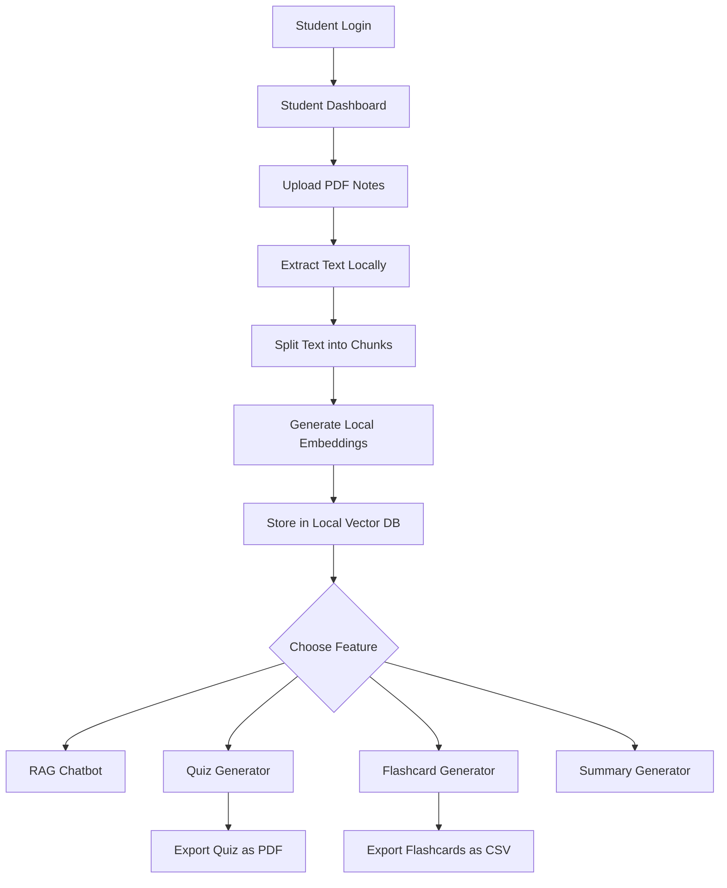
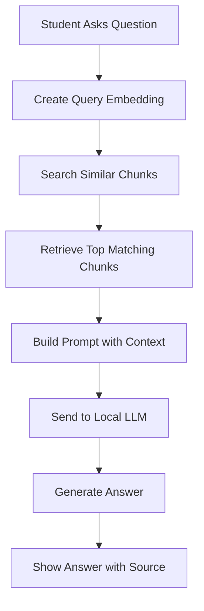
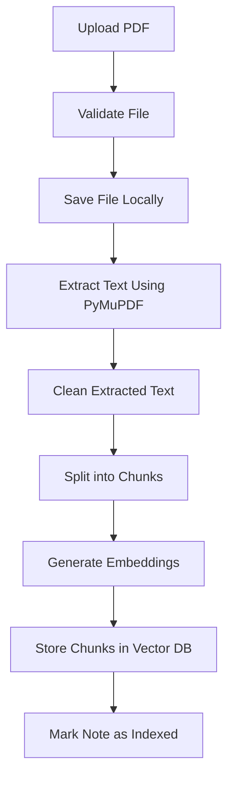
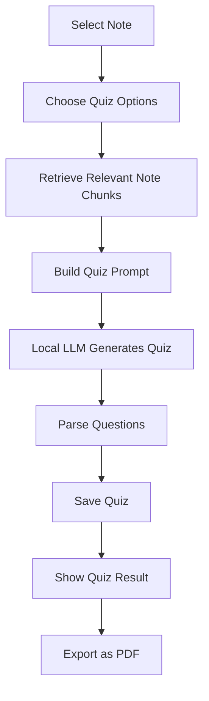
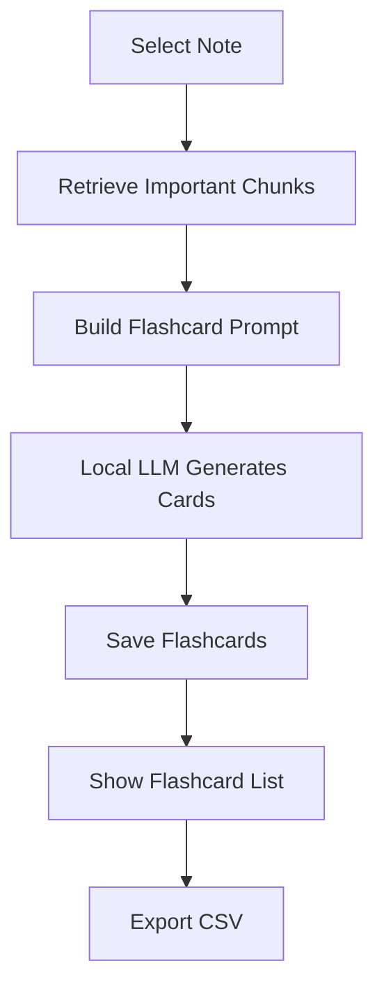
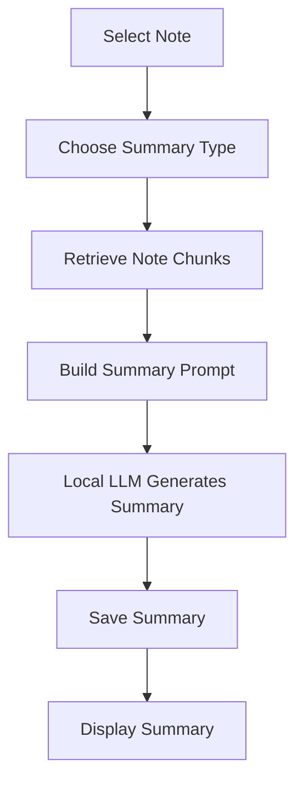

# Flow Diagrams — AI Study Buddy

## 1. Overall System Flow

## 2. RAG Chatbot Flow

## 3. PDF Upload and Indexing Flow

## 4. Quiz Generation Flow

## 5. Flashcard Generation Flow

## 6. Summary Generation Flow

